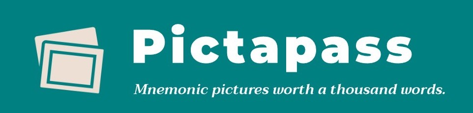

# PictaPass

## Overview

PictaPass is an innovative password generator powered by AI. It not only creates strong, complex passwords for users but also converts these passwords into memorable passphrases, making them easier to recall. Additionally, PictaPass provides an image to assist in password remembrance.

[Read more about it on our About Page](about.html).

## Features

- **Password Generation**: Generate strong and complex passwords with a simple click.
  
- **Passphrase Conversion**: Converts complex passwords into easy-to-remember passphrases. This unique feature replaces certain words with numbers and symbols, like 'ate' with '8', and 'at' with '@'.
  
- **Visual Aid**: Generate images that correlate with the password or passphrase to help users remember their password visually.
  
- **Interactive About Page**: Learn the importance of using mixed-character passwords and why they matter in today's digital age.

## Technologies Involved

PictaPass utilizes vanilla JavaScript and CSS to provide a seamless experience for users while ensuring optimal performance and security. Here's a closer look at the technology stack and techniques involved:

### Front-End:

- **HTML5**: Semantic HTML markup ensures the correct structure and accessibility of the website.
  
- **CSS3**: With external stylesheets like `reset.css`, `styles.css`, and `about.css`, PictaPass's interface is designed to be responsive and user-friendly.
  
- **JavaScript**: Client-side scripting provides interactivity and dynamic content loading, enhancing user engagement. Event listeners, DOM manipulations, and asynchronous operations are utilized extensively.

### Back-End:

- **PictaPass API**: The core functionality of password generation is powered by the MonsterAPI. PictaPass integrates with the [MonsterAPI endpoint](https://api.monsterapi.ai/v1/generate/sdxl-base) to produce memorable images for improved password recall.

### Skills and Techniques:

- **API Integration**: Integrated MonsterAPI's endpoint using asynchronous JavaScript functions (`fetch`), handling both successful responses and possible errors.
  
- **Responsive Design**: The web app is designed to be mobile-friendly and adapt to various screen sizes using media queries and flex-box layouts.
  
- **Performance Optimization**: By using the `defer` attribute in script tags and optimized CSS, the loading and rendering performance of the web app is enhanced.

This project served as a comprehensive exercise in web development, API integrations, and user experience design, effectively showcasing the breadth and depth of modern web technologies and best practices.

## Credits

- Fonts from [Google Fonts](https://fonts.googleapis.com/)
- Image credit: [Specops Software](https://specopssoft.com/blog/best-password-practices-to-defend-against-modern-cracking-attacks/)

